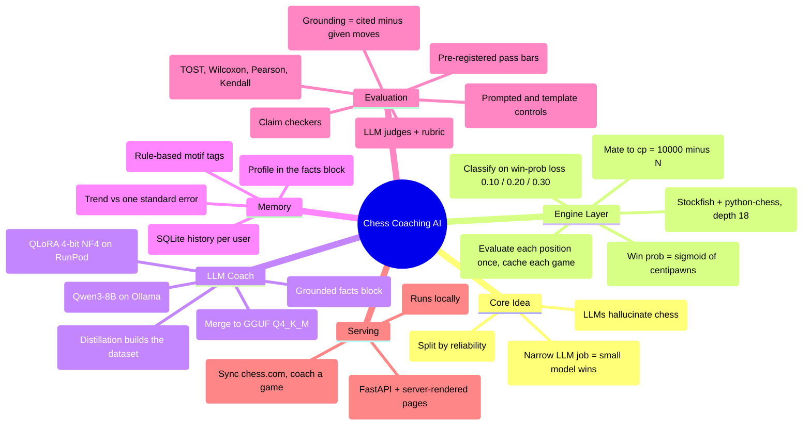

# Chess Analyzer: Concept Mindmap

A one-glance map of the system's layers and their key ideas, as built (updated 2026-10-08).
Renders on GitHub and any Mermaid-aware viewer.

```mermaid
mindmap
  root(("Chess Coaching AI"))
    Core Idea
      ("LLMs hallucinate chess")
      ("Split by reliability")
      ("Narrow LLM job = small model wins")
    Engine Layer
      ("Stockfish + python-chess, depth 18")
      ("Win prob = sigmoid of centipawns")
      ("Classify on win-prob loss 0.10 / 0.20 / 0.30")
      ("Mate to cp = 10000 minus N")
      ("Evaluate each position once, cache each game")
    LLM Coach
      ("Qwen3-8B on Ollama")
      ("Grounded facts block")
      ("QLoRA 4-bit NF4 on RunPod")
      ("Merge to GGUF Q4_K_M")
      ("Distillation builds the dataset")
    Memory
      ("SQLite history per user")
      ("Rule-based motif tags")
      ("Profile in the facts block")
      ("Trend vs one standard error")
    Evaluation
      ("Grounding = cited minus given moves")
      ("Claim checkers")
      ("LLM judges + rubric")
      ("Prompted and template controls")
      ("TOST, Wilcoxon, Pearson, Kendall")
      ("Pre-registered pass bars")
    Serving
      ("FastAPI + server-rendered pages")
      ("Sync chess.com, coach a game")
      ("Runs locally")
```
