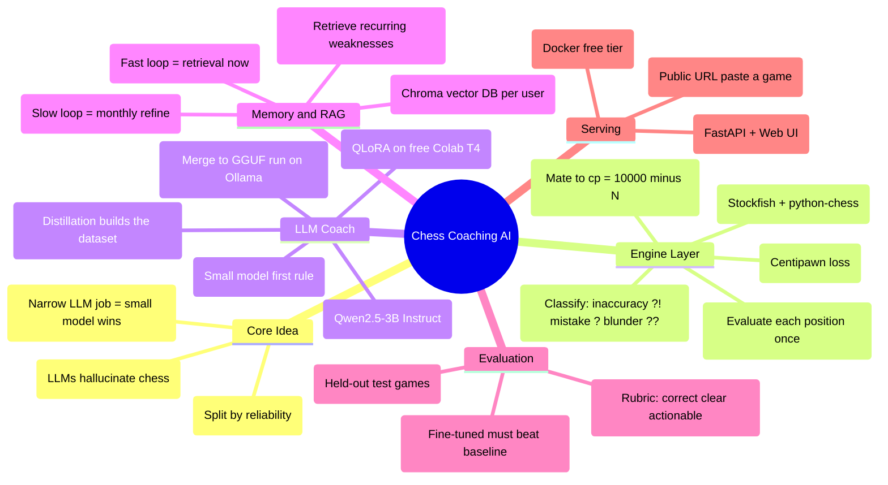

# Chess Analyzer — Concept Mindmap

A one-glance map of the system's six layers and their key ideas.
Renders on GitHub and any Mermaid-aware viewer.

```mermaid
mindmap
  root(("Chess Coaching AI"))
    Core Idea
      ("LLMs hallucinate chess")
      ("Split by reliability")
      ("Narrow LLM job = small model wins")
    Engine Layer
      ("Stockfish + python-chess")
      ("Centipawn loss")
      ("Classify: inaccuracy ?! mistake ? blunder ??")
      ("Mate to cp = 10000 minus N")
      ("Evaluate each position once")
    LLM Coach
      ("Qwen2.5-3B Instruct")
      ("QLoRA on free Colab T4")
      ("Merge to GGUF run on Ollama")
      ("Distillation builds the dataset")
      ("Small model first rule")
    Memory and RAG
      ("Chroma vector DB per user")
      ("Retrieve recurring weaknesses")
      ("Fast loop = retrieval now")
      ("Slow loop = monthly refine")
    Evaluation
      ("Held-out test games")
      ("Rubric: correct clear actionable")
      ("Fine-tuned must beat baseline")
    Serving
      ("FastAPI + Web UI")
      ("Docker free tier")
      ("Public URL paste a game")
```
